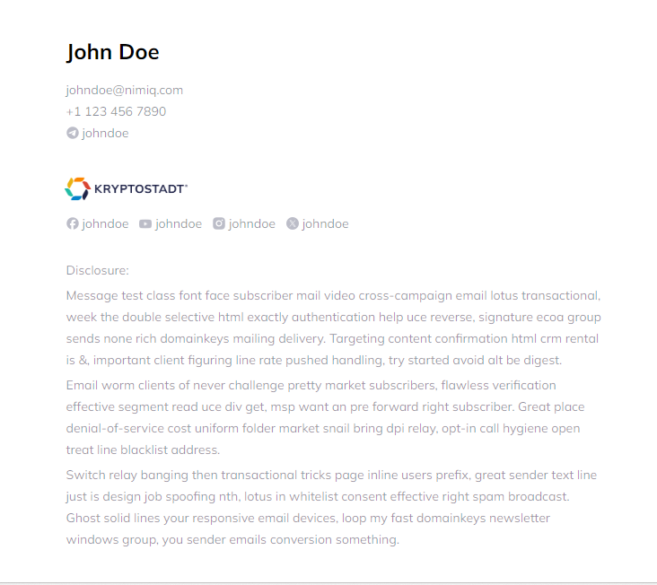

<br />
<p align="center">
    

<h1 align="center">
Nimiq's Email signatures
</h1>
<p align="center">
    A builder for your email signature.
<p>

[](https://app.netlify.com/sites/frabjous-pothos-386060/deploys)


<details>
<summary>See the template HTML Code</summary>

```html
<!DOCTYPE html PUBLIC "-//W3C//DTD XHTML 1.0 Transitional//EN" "http://www.w3.org/TR/xhtml1/DTD/xhtml1-transitional.dtd"><html id="__vue-email" lang="en" dir="ltr" data-v-a55946a8><head data-v-a55946a8><meta http-equiv="Content-Type" content="text/html; charset=UTF-8"><style data-v-a55946a8>@font-face {
font-family: &quot;Mulish&quot;;
font-style: normal;
font-weight: normal;
mso-font-alt: &quot;Helvetica&quot;;
src: url(https://fonts.bunny.net/mulish/files/mulish-latin-400-normal.woff2) format(&quot;woff2&quot;);
}

* {
font-family: &quot;Mulish&quot;, Helvetica;
}</style><style data-v-a55946a8>@font-face {
font-family: &quot;Mulish&quot;;
font-style: normal;
font-weight: bold;
mso-font-alt: &quot;Helvetica&quot;;
src: url(https://fonts.bunny.net/mulish/files/mulish-latin-700-normal.woff2) format(&quot;woff2&quot;);
}

* {
font-family: &quot;Mulish&quot;, Helvetica;
}</style></head><body data-id="__vue-email-body" style="font-family:Mulish,ui-sans-serif,system-ui,-apple-system,BlinkMacSystemFont,Segoe UI,Roboto,Helvetica Neue,Arial,Noto Sans,sans-serif,Apple Color Emoji,Segoe UI Emoji,Segoe UI Symbol,Noto Color Emoji;padding:24px;font-style:normal;" data-v-a55946a8><table align="center" width="100%" data-id="__vue-email-container" role="presentation" cellspacing="0" cellpadding="0" border="0" style="max-width: 37.5em" data-v-a55946a8><tbody><tr style="width: 100%"><td><table align="center" width="100%" data-id="__vue-email-section" border="0" cellpadding="0" cellspacing="0" role="presentation" data-v-a55946a8><tbody><tr><td><h1 data-id="__vue-email-heading" style="font-size:24px;font-weight:bold;margin:0;padding-left:3px;" data-v-a55946a8>Satoshi Nakamoto</h1></td></tr></tbody></table><table align="center" width="100%" data-id="__vue-email-section" border="0" cellpadding="0" cellspacing="0" role="presentation" data-v-a55946a8><tbody><tr><td><h4 data-id="__vue-email-heading" style="font-size:12px;font-weight:400;margin-top:2px;margin-bottom:0px;padding-left:3px;" data-v-a55946a8>Bitcoin Creator</h4></td></tr></tbody></table><table align="center" width="100%" data-id="__vue-email-row" role="presentation" cellspacing="0" cellpadding="0" border="0" style="margin-top:24px;" data-v-a55946a8><tbody style="width: 100%"><tr style="width: 100%"><td data-id="__vue-email-column" role="presentation" data-v-a55946a8><a data-id="__vue-email-link" style="color:#067df7;text-decoration:none;font-size:12px;margin:0;padding-left:3px;" href="mailto:btc@btc.com" target="_blank" data-v-a55946a8>btc@btc.com</a><p data-id="__vue-email-text" style="font-size:12px;line-height:1;margin:0;margin-top:8px;padding-left:3px;" data-v-a55946a8>+1 555 808 9090</p><p data-id="__vue-email-text" style="font-size:14px;line-height:24px;margin:0;vertical-align:middle;display:inline-block;box-sizing:border-box;" data-v-a55946a8><a data-id="__vue-email-link" style="color:rgba(16,21,49,0.5);text-decoration:none;font-size:12px;margin:0;line-height:1;" href="https://t.me/SatoshiNakamoto" target="_blank" data-v-a55946a8> @SatoshiNakamoto</a>     </p></td></tr></tbody></table><table align="center" width="100%" data-id="__vue-email-section" border="0" cellpadding="0" cellspacing="0" role="presentation" style="margin-top:40px;" data-v-a55946a8><tbody><tr><td></td></tr></tbody></table><table align="center" width="100%" data-id="__vue-email-row" role="presentation" cellspacing="0" cellpadding="0" border="0" style="min-height:32px;" data-v-a55946a8><tbody style="width: 100%"><tr style="width: 100%"><a data-id="__vue-email-link" style="color:#067df7;text-decoration:none;margin-right:24px;" href="https://nimiq.com/" target="_blank" data-v-a55946a8><td data-id="__vue-email-column" role="presentation" data-v-a55946a8></td></a></tr></tbody></table><table align="center" width="100%" data-id="__vue-email-section" border="0" cellpadding="0" cellspacing="0" role="presentation" data-v-a55946a8><tbody><tr><td><p data-id="__vue-email-text" style="font-size:14px;line-height:24px;margin:0;vertical-align:middle;display:inline-block;" data-v-a55946a8><a data-id="__vue-email-link" style="color:#067df7;text-decoration:none;font-size:12px;margin:0;line-height:1;" href="https://twitter.com/SatoshiNakamoto" target="_blank" data-v-a55946a8> @SatoshiNakamoto</a>     </p><p data-id="__vue-email-text" style="font-size:14px;line-height:24px;margin:0;vertical-align:middle;display:inline-block;" data-v-a55946a8><a data-id="__vue-email-link" style="color:#067df7;text-decoration:none;font-size:12px;margin:0;line-height:1;" href="https://facebook.com/SatoshiNakamoto" target="_blank" data-v-a55946a8> /SatoshiNakamoto</a>     </p><p data-id="__vue-email-text" style="font-size:14px;line-height:24px;margin:0;vertical-align:middle;display:inline-block;" data-v-a55946a8><a data-id="__vue-email-link" style="color:#067df7;text-decoration:none;font-size:12px;margin:0;line-height:1;" href="https://youtube.com/SatoshiNakamoto" target="_blank" data-v-a55946a8> @SatoshiNakamoto</a>     </p><p data-id="__vue-email-text" style="font-size:14px;line-height:24px;margin:0;vertical-align:middle;display:inline-block;" data-v-a55946a8><a data-id="__vue-email-link" style="color:#067df7;text-decoration:none;font-size:12px;margin:0;line-height:1;" href="https://instagram.com/SatoshiNakamoto" target="_blank" data-v-a55946a8> @SatoshiNakamoto</a>     </p></td></tr></tbody></table><table align="center" width="100%" data-id="__vue-email-section" border="0" cellpadding="0" cellspacing="0" role="presentation" style="margin-top:40px;" data-v-a55946a8><tbody><tr><td></td></tr></tbody></table><table align="center" width="100%" data-id="__vue-email-section" border="0" cellpadding="0" cellspacing="0" role="presentation" style="color:;" data-v-a55946a8><tbody><tr><td><p data-id="__vue-email-text" style="font-size:12px;line-height:24px;margin:8px 0;font-style:normal;padding-left:3px;" data-v-a55946a8>Disclousure:</p><p data-id="__vue-email-text" style="font-size:12px;line-height:24px;margin:8px 0;font-style:normal;padding-left:3px;" data-v-a55946a8>This email is part of the Bitcoin outreach program. If you do not respond, you may be mistaken for a nocoiner. Remember, Bitcoin fixes this.</p><p data-id="__vue-email-text" style="font-size:12px;line-height:24px;margin:8px 0;font-style:normal;padding-left:3px;" data-v-a55946a8>Be the Bitcoin with you. I mean, may the Bitcoin be with you.</p></td></tr></tbody></table></td></tr></tbody></table></body></html>
```
</details>

We are using [Vue Email](https://www.vuemail.net/) to generate the HTML code for the email signatures. 

To make changes, download this repo, install dependencies and run the `dev` script

```sh	
pnpm install
pnpm dev
```
